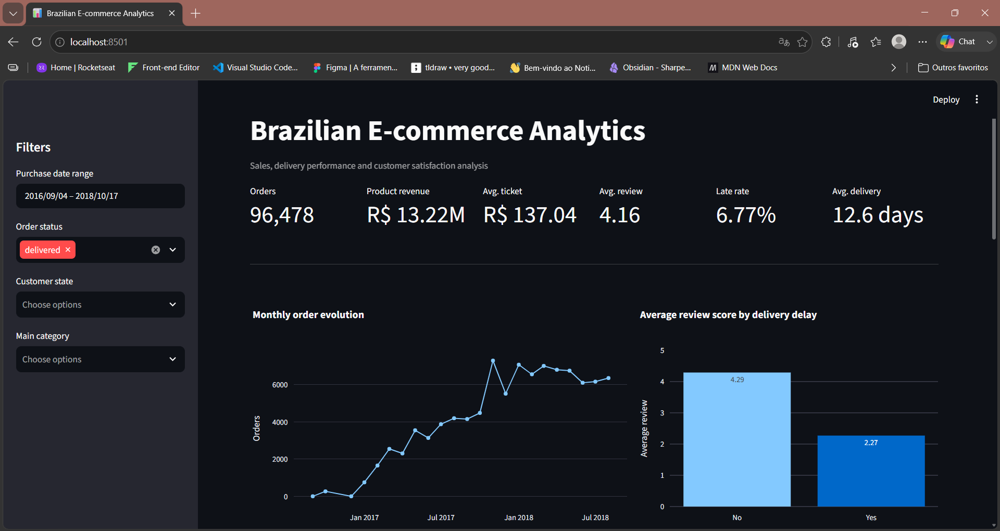
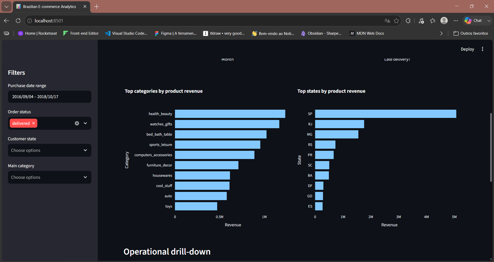
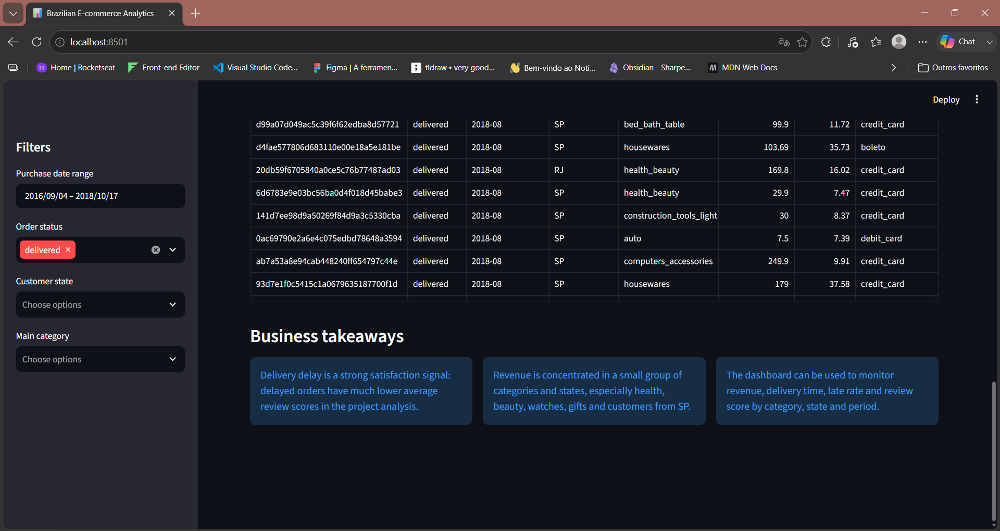

# Brazilian E-commerce Analytics

Projeto de Data Analytics usando dados publicos de e-commerce brasileiro da Olist.

O objetivo e analisar vendas, entregas, categorias, localizacao de clientes, pagamentos e avaliacoes para identificar oportunidades de melhoria em performance comercial, logistica e satisfacao do cliente.

Este projeto foi desenvolvido como portfolio para oportunidades de estagio, BI e Analista de Dados Junior.

## Problema de negocio

Marketplaces dependem de uma boa combinacao entre sortimento, preco, pagamento, entrega e experiencia do cliente. Mesmo quando as vendas crescem, problemas logisticos podem prejudicar a avaliacao e a recompra.

Neste projeto, a analise busca responder:

1. Qual e o volume de pedidos por status?
2. Como os pedidos evoluiram ao longo do tempo?
3. Quais categorias geram mais receita?
4. Quais estados concentram faturamento?
5. Entregas atrasadas impactam a nota do cliente?
6. Quais categorias apresentam maior taxa de atraso?
7. Quais meios de pagamento sao mais usados?

## Fonte dos dados

Dataset: [Brazilian E-Commerce Public Dataset by Olist](https://www.kaggle.com/datasets/olistbr/brazilian-ecommerce)

O dataset possui aproximadamente 100 mil pedidos realizados entre 2016 e 2018 em marketplaces brasileiros. Os dados sao anonimizados e incluem pedidos, clientes, vendedores, itens, produtos, pagamentos, entregas e avaliacoes.

## Tecnologias utilizadas

- Python
- Pandas
- Jupyter Notebook
- SQL
- SQLite
- Matplotlib
- Seaborn
- Streamlit
- Plotly
- Git e GitHub

## Estrutura do projeto

```text
.
+-- data/
|   +-- raw/              # Dados originais baixados do Kaggle
|   +-- processed/        # Dataset analitico tratado
|   +-- database/         # Banco SQLite local
+-- docs/                 # Planejamento, dicionario e conclusoes
+-- notebooks/            # Notebooks de analise
+-- reports/              # Materiais finais e imagens
+-- app/                  # Dashboard interativo em Streamlit
+-- sql/                  # Consultas SQL
+-- src/                  # Scripts reutilizaveis
+-- README.md
+-- requirements.txt
```

## Etapas realizadas

1. Organizacao do projeto e estrutura de pastas.
2. Coleta e armazenamento dos dados brutos.
3. Entendimento das tabelas e checagem de qualidade.
4. Analise exploratoria inicial com Python.
5. Criacao de uma tabela analitica consolidada no nivel pedido.
6. Criacao de banco SQLite local.
7. Consultas SQL para responder perguntas de negocio.
8. Documentacao dos principais insights.
9. Criacao de dashboard interativo em Streamlit.

## Notebooks

| Notebook | Objetivo |
| --- | --- |
| `01_data_understanding.ipynb` | Entender arquivos, colunas, linhas e valores ausentes. |
| `02_exploratory_analysis.ipynb` | Fazer analise exploratoria inicial com graficos. |
| `03_feature_engineering_and_dataset.ipynb` | Criar tabela analitica consolidada. |
| `04_sql_business_analysis.ipynb` | Responder perguntas de negocio com SQL. |

## Dataset analitico

Foi criada uma tabela consolidada no nivel pedido:

```text
data/processed/orders_analytics.csv
```

Validacao da tabela:

| Metrica | Valor |
| --- | ---: |
| Linhas | 99.441 |
| Colunas | 30 |
| Pedidos unicos | 99.441 |
| Pedidos duplicados | 0 |

Principais campos criados:

- `product_revenue`
- `freight_value`
- `payment_value`
- `main_category`
- `main_payment_type`
- `delivery_days`
- `delay_days`
- `is_late`
- `review_score`
- `customer_state`
- `order_year_month`

## Principais resultados

### Status dos pedidos

A maior parte dos pedidos esta no status `delivered`.

| Status | Pedidos |
| --- | ---: |
| delivered | 96.478 |
| shipped | 1.107 |
| canceled | 625 |
| unavailable | 609 |
| invoiced | 314 |
| processing | 301 |

### Categorias com maior receita

| Categoria | Pedidos | Receita |
| --- | ---: | ---: |
| health_beauty | 8.613 | 1.233.813,10 |
| watches_gifts | 5.478 | 1.167.152,18 |
| bed_bath_table | 9.184 | 1.024.243,76 |
| sports_leisure | 7.493 | 954.525,89 |
| computers_accessories | 6.512 | 888.593,98 |

### Estados com maior faturamento

| Estado | Pedidos | Receita |
| --- | ---: | ---: |
| SP | 40.501 | 5.067.633,16 |
| RJ | 12.350 | 1.759.651,13 |
| MG | 11.354 | 1.552.481,83 |
| RS | 5.345 | 728.897,47 |
| PR | 4.923 | 666.063,51 |

### Atraso e avaliacao

Pedidos atrasados possuem nota media muito menor.

| Entrega atrasada | Pedidos | Nota media | Atraso medio |
| --- | ---: | ---: | ---: |
| Nao | 89.443 | 4,29 | -13,51 dias |
| Sim | 6.381 | 2,27 | 10,52 dias |

Insight principal:

> Entregas atrasadas estao associadas a uma queda relevante na satisfacao do cliente. A nota media cai de 4,29 em pedidos nao atrasados para 2,27 em pedidos atrasados.

### Categorias com maior taxa de atraso

Filtro: categorias com pelo menos 500 pedidos entregues.

| Categoria | Pedidos entregues | Taxa de atraso | Nota media |
| --- | ---: | ---: | ---: |
| baby | 2.761 | 8,11% | 4,12 |
| office_furniture | 1.251 | 8,07% | 3,65 |
| electronics | 2.502 | 7,67% | 4,13 |
| musical_instruments | 608 | 7,57% | 4,24 |
| health_beauty | 8.613 | 7,54% | 4,23 |

### Tipos de pagamento

| Pagamento | Pedidos | Valor pago | Parcelas medias |
| --- | ---: | ---: | ---: |
| credit_card | 72.825 | 12.102.206,16 | 3,55 |
| boleto | 19.191 | 2.769.932,58 | 1,00 |
| voucher | 2.977 | 341.951,91 | 1,15 |
| debit_card | 1.484 | 208.371,12 | 1,00 |

## Recomendacoes de negocio

1. Monitorar atraso de entrega como indicador critico de satisfacao.
2. Priorizar investigacao logistica em categorias com maior taxa de atraso, como `baby` e `office_furniture`.
3. Acompanhar regioes com maior tempo medio de entrega para identificar gargalos operacionais.
4. Criar indicadores no dashboard para comparar nota media, atraso e receita por categoria e estado.
5. Usar o status `delivered` como base principal para analises comerciais consolidadas.

## Como reproduzir o projeto

Clone o repositorio e instale as dependencias:

```powershell
python -m venv .venv
.\.venv\Scripts\activate
pip install -r requirements.txt
```

Baixe o dataset da Olist no Kaggle e coloque os arquivos `.csv` em:

```text
data/raw/
```

Execute os notebooks em ordem:

```text
01_data_understanding.ipynb
02_exploratory_analysis.ipynb
03_feature_engineering_and_dataset.ipynb
04_sql_business_analysis.ipynb
```

Para recriar o banco SQLite:

```powershell
python src\create_sqlite_database.py
```

## SQL

As principais consultas estao em:

```text
sql/business_questions.sql
```

O notebook `04_sql_business_analysis.ipynb` executa essas consultas sobre o banco SQLite local.

## Dashboard interativo

O projeto tambem possui um dashboard em Streamlit:

```text
app/streamlit_app.py
```

Para executar:

```powershell
streamlit run app/streamlit_app.py
```

O dashboard inclui:

- KPIs de pedidos, receita, ticket medio, nota media, taxa de atraso e tempo medio de entrega.
- Filtros por periodo, status, estado e categoria.
- Evolucao mensal de pedidos.
- Top categorias por receita.
- Top estados por receita.
- Comparacao entre atraso de entrega e nota media.
- Tabela detalhada para exploracao operacional.

### Dashboard preview

Overview:



Top categories and states:



Operational drill-down and takeaways:



## Documentacao auxiliar

- `docs/project_plan.md`: plano do projeto.
- `docs/data_dictionary.md`: dicionario inicial de dados.
- `docs/sql_findings.md`: conclusoes da analise SQL.

## Proximas etapas

- Exportar prints do dashboard para `reports/`.
- Criar resumo executivo final.
- Preparar publicacao para LinkedIn.

## Abordagem AI-assisted

Este projeto foi conduzido com abordagem AI-assisted. A IA apoiou estruturacao, codigo, documentacao, revisao e geracao de ideias.

As decisoes analiticas, validacoes, interpretacao dos resultados e direcionamento do projeto foram conduzidos pelo autor.
